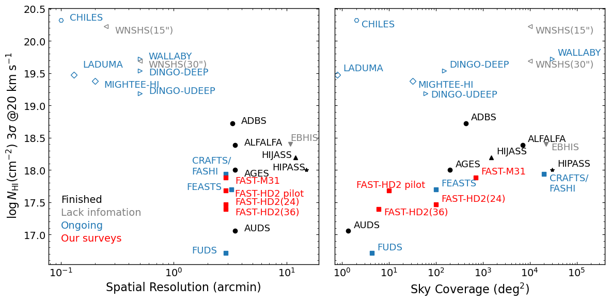

<!-- Hero Section -->
<section class="hero">
    

        <h1 class="hero-title">HI Survey conducted by CCG@NAOC</h1>
        
Medium-coverage HI Deep surveys with the Five-hundred-meter Aperture Spherical radio Telescope (FAST), by Computational Cosmology Group @ NAOC

        

            <a href="{{ '/hd2/' | relative_url }}" class="btn btn-primary">The FAST Hundred-deg² HI Deep (HD²) Survey</a>
            <a href="{{ '/m31/' | relative_url }}" class="btn btn-secondary">The FAST M31 HI Deep Survey</a>
        

    

</section>

<!-- About HI Surveys -->
<section class="container">
    

        <h2 class="section-title">About HI Surveys</h2>
        
        
Neutral hydrogen (HI) is the most abundant element in the universe and serves as a fundamental tracer of cosmic structure. The 21-cm hyperfine transition line of HI provides a unique window into the distribution, kinematics, and physical conditions of gas in galaxies, enabling studies of galaxy formation, evolution, and cosmology.

        
        
The <a href="https://fast.bao.ac.cn/" target="_blank" rel="noopener">FAST</a> (Five-hundred-meter Aperture Spherical radio Telescope), located in Guizhou Province, China, is the world's largest single-dish radio telescope. With its unprecedented sensitivity and large collecting area, FAST opens new frontiers for HI astronomy, allowing us to probe fainter and more distant HI emissions than ever before.

        
        

            <h3 class="info-box-title">Why FAST for HI?</h3>
            <ul>
                <li><strong>World-leading sensitivity:</strong> 300m effective aperture provides unmatched collecting area</li>
                <li><strong>Wide frequency coverage:</strong> 1.0 - 1.5 GHz for the L band receiver, covering redshifted HI lines to z = 0.4 </li>
                <li><strong>19-beam receiver:</strong> Efficient large-area surveys with the L-band array</li>
                <li><strong>Excellent sky coverage:</strong> Accessible to declinations between -14° and +66°</li>
            </ul>
        

    

</section>

<!-- HI Survey Comparison -->
<section class="container">
    

        <h2 class="section-title">HI Survey Landscape</h2>
        
        
Current HI surveys span a wide range of sky coverage and depth, each optimized for different scientific goals. Wide-field surveys like <a href="http://egg.astro.cornell.edu/alfalfa/" target="_blank" rel="noopener">ALFALFA</a> (Arecibo Legacy Fast ALFA) and <a href="https://fashi.bao.ac.cn/" target="_blank" rel="noopener">FASHI</a> (FAST All Sky HI Survey) cover thousands of square degrees with moderate sensitivity, providing large statistical samples but limited to nearby galaxies (z ≲ 0.06). At the other extreme, ultra-deep surveys like <a href="https://www.atnf.csiro.au/research/AUDS/" target="_blank" rel="noopener">AUDS</a> (ASKAP Ultra Deep Survey) and <a href="https://www.atnf.csiro.au/research/FUDS/" target="_blank" rel="noopener">FUDS</a> (FAST Ultra Deep Survey) target very small areas (a few deg²) with hundreds of hours of integration, reaching high redshifts (z ~ 0.4) but may suffer from cosmic variance.

        
        
Medium-area deep surveys fill the critical gap between these extremes. <a href="https://www.atnf.csiro.au/research/DINGO/" target="_blank" rel="noopener">DINGO</a> (Deep Investigation of Neutral Gas Origins) with ASKAP will cover 60–150 deg², while <a href="https://www.mighteesurvey.org/" target="_blank" rel="noopener">MIGHTEE-HI</a> (MeerKAT International GHz Tiered Extragalactic Exploration) and the <a href="https://www.sarao.ac.za/science/meerkat-science/meerkat-fornax-survey/" target="_blank" rel="noopener">MeerKAT Fornax Survey</a> each probe ~32 deg² and ~12 deg² respectively. These surveys offer a balance between volume and sensitivity, enabling studies of rare populations and environmental effects that are inaccessible to both wide shallow surveys and ultra-deep pencil beams.

        
However, these interferometric surveys are still limited in sensitivity compared to single-dish telescopes. To overcome this limitation, we have initiated two complementary medium-area deep HI surveys with FAST: the <strong>HD²</strong> (Hundred-deg² HI Deep) Survey targeting extragalactic HI in a 100 deg² field overlapped with DESI, and the <strong>M31</strong> survey for resolved HI mapping in the 160 kpc radius of M31 halo. Their survey parameters—spatial resolution, sky coverage, and column density sensitivity—are compared with other HI surveys in the figure below.

        
        

            
            

                <strong>Figure:</strong> Comparison of HI surveys in terms of spatial resolution vs. column density sensitivity (left) and sky coverage vs. column density sensitivity (right). Our surveys (red squares) occupies a unique parameter space, combining arcminute-scale spatial resolution with hundreds of deg² sky coverage while achieving deep column density limits of log NHI ~ 17.5 cm-2 at 20 km s-1 resolution — a balance unmatched by wide-field shallow surveys or ultra-deep surveys.
            

        

        

            <h3 class="info-box-title">Why conduct HD² and M31 Surveys with FAST?</h3>
            <ul>
                <li><strong>Unmatched Sensitivity:</strong> FAST achieves sensitivity two orders of magnitude deeper than interferometric surveys, enabling detection of faint, extended HI emission missed by ASKAP and MeerKAT</li>
                <li><strong>Optimal Survey Volume:</strong> ~100 deg² strikes the balance between cosmic variance and statistical power, providing robust samples for galaxy evolution studies</li>
                <li><strong>Synergy with DESI:</strong> Deep optical spectroscopy from DESI enables precise optical counterpart identification and redshift confirmation, with matching rates exceeding 90% for r < 19.5 mag galaxies</li>
                <li><strong>Low-Mass Galaxy Census:</strong> Extend HI detections to stellar masses down to 10⁸ M⊙, constraining the faint end of the HI mass function and gas accretion in dwarf galaxies</li>
                <li><strong>Rare Population Discovery:</strong> Optimal for finding ultra-diffuse galaxies, low surface brightness systems, HI-rich early-types, and dark gas clouds (RELIHCs) that evade shallow surveys</li>
                <li><strong>Local Group Benchmark:</strong> The M31 survey provides resolved HI mapping of our nearest major neighbor's halo region, serving as a fundamental calibration for cosmological simulations and galaxy formation models</li>
            </ul>
        

    

</section>

<!-- Survey Projects -->
<section class="container">
    

        <h2 class="section-title">Our Survey Projects</h2>
        
        

            <!-- HD2 Survey -->
            

                
🔭

                

                    <h3 class="feature-card-title">HD² Survey</h3>
                    

                        A deep HI survey covering 100 deg² within the DESI footprint, leveraging FAST's unmatched sensitivity and DESI's high-completeness spectroscopy to detect faint HI emissions from galaxies down to 10⁸ Msun.
                    

                    

                        <a href="{{ '/hd2/' | relative_url }}" class="btn btn-outline">Overview</a>
                        <a href="{{ '/hd2/science' | relative_url }}" class="btn btn-outline">Science</a>
                        <a href="{{ '/hd2/publications' | relative_url }}" class="btn btn-outline">Publications</a>
                        <a href="{{ '/hd2/data' | relative_url }}" class="btn btn-outline">Data</a>
                    

                

            

            
            <!-- M31 Survey -->
            

                
🌌

                

                    <h3 class="feature-card-title">M31 Survey</h3>
                    

                        A 700 deg² HI survey of the Andromeda Galaxy (M31) and its halo within 160 kpc, mapping the detailed distribution of neutral gas in M31's disk and halo while simultaneously enabling studies of high-velocity clouds in the Milky Way and M31 halos, supernova remnants, and serving as an extragalactic point-source survey for background HI galaxies..
                    

                    

                        <a href="{{ '/m31/' | relative_url }}" class="btn btn-outline">Overview</a>
                        <a href="{{ '/m31/science' | relative_url }}" class="btn btn-outline">Science</a>
                        <a href="{{ '/m31/publications' | relative_url }}" class="btn btn-outline">Publications</a>
                        <a href="{{ '/m31/data' | relative_url }}" class="btn btn-outline">Data</a>
                    

                

            

        

    

</section>

<!-- Research Focus -->
<section class="container">
    

        <h2 class="section-title">Research Focus</h2>
        
        

            

                

                    
🌌

                    <h3 class="card-title">Galaxy Formation & Evolution</h3>
                

                

                    
Investigating the low-redshift HI mass function, gas fraction scaling relations with stellar mass and star formation rate, and the role of HI as the fuel reservoir for star formation and baryon cycling in galaxies.

                

            

            
            

                

                    
🔄

                    <h3 class="card-title">HI Distribution & Galaxy Dynamics</h3>
                

                

                    
Mapping the spatial distribution of neutral hydrogen from galactic disks to extended halos, probing galaxy kinematics and mass distributions through HI rotation curves, including detailed mapping of M31's dynamics and circumgalactic medium.

                

            

            
            

                

                    
💥

                    <h3 class="card-title">Milky Way HI & Supernova Remnants</h3>
                

                

                    
Studying the Milky Way's neutral hydrogen distribution and its interaction with supernova remnants, using high-velocity cloud observations to trace feedback and gas recycling processes.

                

            

            
            

                

                    
📡

                    <h3 class="card-title">21cm Intensity Mapping</h3>
                

                

                    
Pushing toward cosmological applications by developing 21cm intensity mapping techniques at z ~ 0.3, bridging the gap between low-redshift HI surveys and future high-redshift cosmology experiments.

                

            

        

    

</section>

<!-- Contact -->
<section class="container">
    

        <h2 class="section-title">Contact</h2>
        
        
For inquiries about our HI surveys, data access, or collaboration opportunities, please contact the CCG group or visit our <a href="{{ '/people' | relative_url }}">people page</a> for individual contact information.

        
        

            <strong>Data Access:</strong> Survey data products are available through the individual project pages. See <a href="{{ '/hd2/data' | relative_url }}">HD² Data</a> and <a href="{{ '/m31/data' | relative_url }}">M31 Data</a> for downloads.
        

    

</section>
